# Recipe Sharing

## Contents
* [Introduction](#introduction) 
  * [Objective](#objective)
  * [Proposal](#proposal)
* [Architecture](#architecture)
  * [Risk Assessment](#risk-assessment)
  * [Trello Board](#trello-board)
  * [Entity Relationship Diagram](#entity-relationship-diagram)
  * [Test Analysis](#analysis-of-testing)
  * [Continuous Integration](#continuous-integration)
* [Development](#development)
  * [Unit Testing](#unit-testing)
  * [Front-End Design](#front-end)
  * [Integration Testing](#integration-testing)
* [Footer](#footer)

## Introduction

### Objective
The objective provided for this project is as follows:
> To create a CRUD application with utilisation of supporting tools,
methodologies and technologies that encapsulate all core modules
covered during training.

More specifically, the following is required:
* Functioning CRUD application created in Python
* Functioning front-end to website using Flask
* Trello board or equivalent
* Relational database - must contain at least one one-to-many relationship
* Clear documentation
* Detailed risk assessment
* Automated tests 
* Fully integrated into Github or other VCS

### Proposal
I've decided to make a cooking recipes sharing site, where users are able to create a profile, and then upload recipes they have found. Other users may then view uploaded recipes, and other users' profiles.

An outline of how CRUD will be implemented can be seen below.

**Create**:
* user/profile information
* recipes
  * title
  * description
  * ingredients
  * method
  * footer

**Read**:
* other profiles, including post history
* recipes

**Update**:
* profile information
* own recipes

**Delete**:
* user/profile
* own recipes

## Architecture
### Risk Assessment
My detailed Risk Assessment can be seen below, outlining the major and minor risks associated with this project.
<br/><br/>
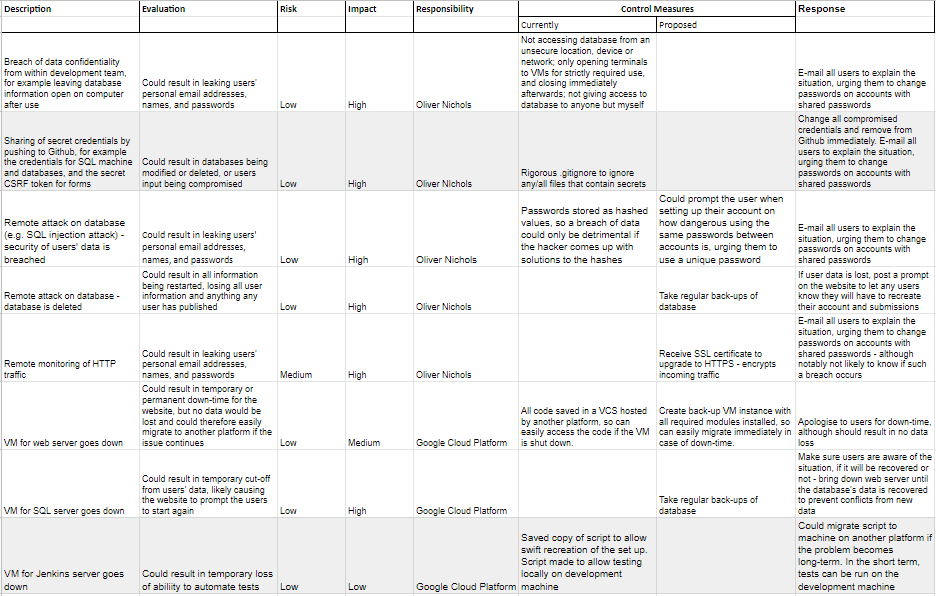
<br/>
The highlighted rows in the table were added at a later date after new risks became clear.  
The full risk assessment can be found [here](https://docs.google.com/spreadsheets/d/1rmqhFgW-Qwi52n_LbR-T77hh7dNrqLTI9gA4RVbdwOs/edit?usp=sharing).

### Trello Board
The progress of my project was documented using a Trello board.
<br/><br/>
I decided to use Trello over other similar tools, such as Jira, as Trello is lightweight, free-to-use, and is focused on presenting the project in a more visual way. Since this project is small scale, Trello fits my needs perfectly.
<br/><br/>
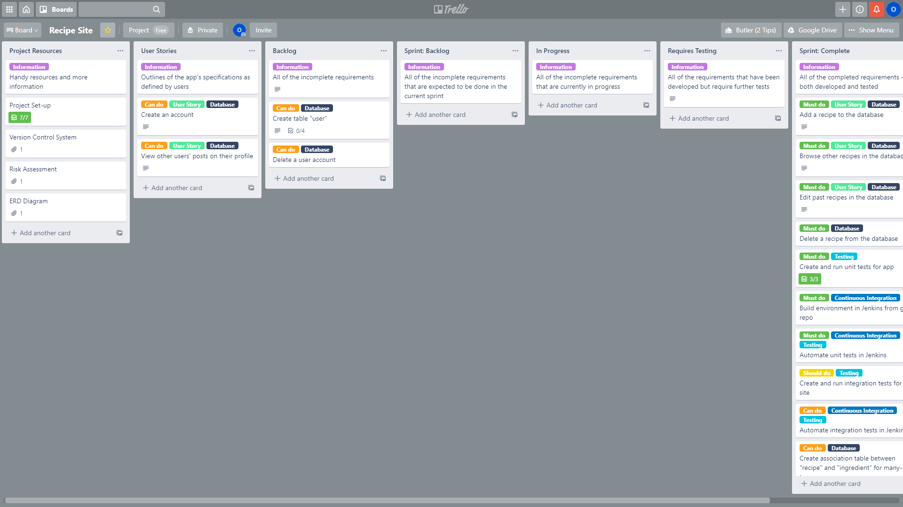
The full board can be found at https://trello.com/b/sdSEOik1/recipe-site.

### Entity Relationship Diagram

My outdated ERD can be seen below, followed by the updated version to cover the changes to my project since its original proposal.  

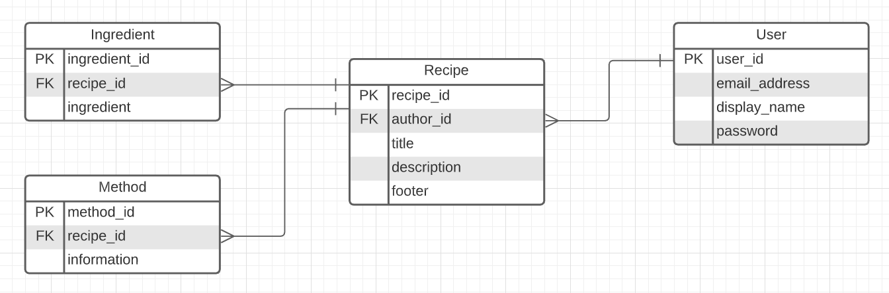
<br/>

<div style="block;"> 
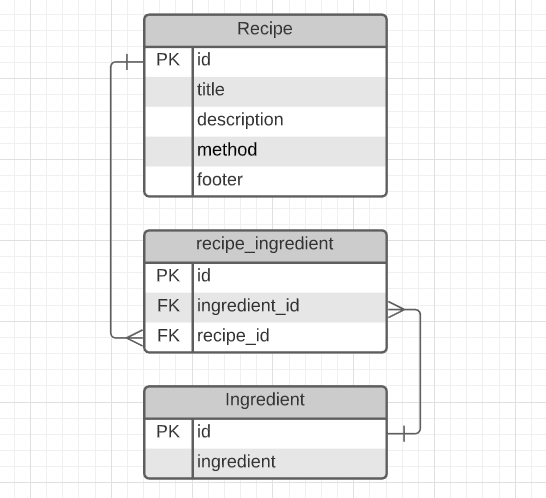

My updated ERD can be seen to the left, mapping how my database is currently structured.
<br/><br/>
The structure to the database was changed from the original proposal due to a realisation that login validation is out of the scope of this project.
<br/><br/>
I've decided to use a many-to-many relationship with the recipe_ingredient table breaking this into two many-to-one relationships. The many-to-many is formed because each recipe should have several ingredients, but several recipes may share the same ingredients.
<br/><br/>
Having this relationship allows users to simply find ingredients in the database if they're already added. This also allows further ingredient-related features to be implemented, such as having average prices for each ingredient.
<br/><br/>
<br/>

</div>

### Analysis of Testing

This project only includes unit and integration testing, which are both fairly basic forms of testing. There are clearly plenty of other forms of testing that could be implemented were it in the scope of this project. Some key levels of testing that aren't utilized here include system testing, and acceptance testing. More specifically, we are not testing any of the below. 
<br/>

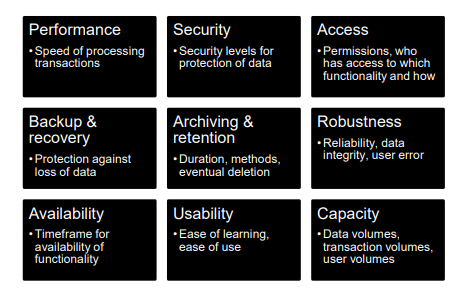
[reference](http://www.qafileshare.com/mcw/deloitte/deloitteselfstudy/PRDTRE.pdf)

<br/>

As my project utilized a test-driven approach, I created some plans for my unit and integration tests as can be seen below. As tests were made, the spreadsheet was filled in.  
<br/>
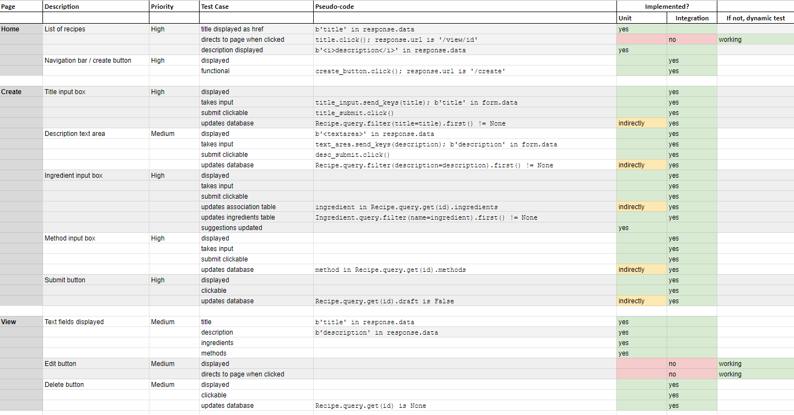
The original document can be viewed [here](https://docs.google.com/spreadsheets/d/10RfsV4W0lehhegrDaMUFKeGhDfPXYNNM9VVzMzV0x_Y/edit?usp=sharing)

### Continuous Integration
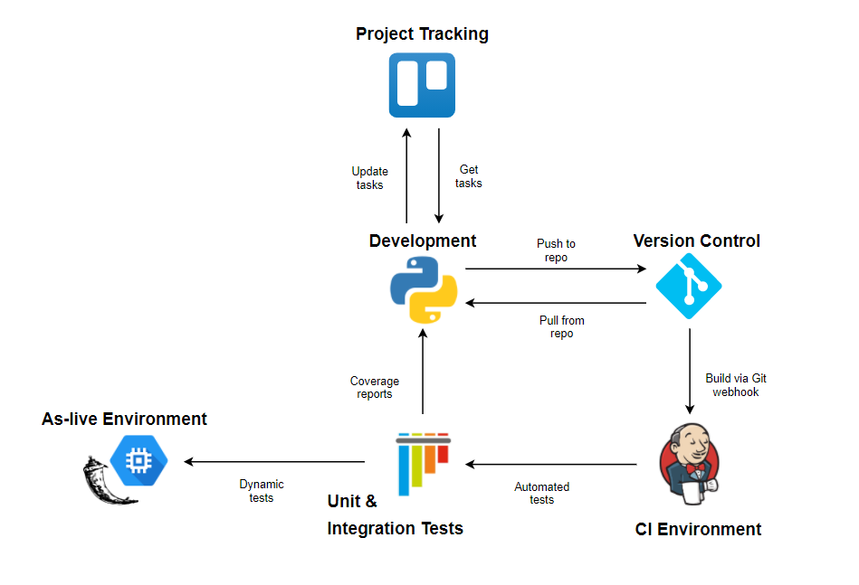
<br/>
Continuous integration is used in my project to allow rapid and smooth development-to-deployment, focusing on automating testing. In my approach, as code is pushed to Github, Jenkins will fetch and build the repository, and then run unit and integration tests. The developer is then able to view the reports produced and can refactor the program as required.
<br/>

#### Jenkins Script
The build script can be broken into five stages, shown below.  
<br/>

**1.** Installation of the virtual environment

```
sudo apt install chromium-chromedriver -y
sudo apt-get install python3-venv

python3 -m venv venv
source venv/bin/activate

pip3 install -r requirements.txt
```
<br/>

**2.** Stopping existing processes that may interfere

```
sudo systemctl stop recipe-project
sudo rm pytest-result
```

**3.** Unit and integration testing

```
python3 -m pytest tests --cov=application --cov-report term-missing --disable-warnings
```
<br/>

**4.** Running as-live environment on systemd process
```
sudo cp -r . /opt/project

sudo systemctl daemon-reload
sudo systemctl start recipe-project
```

**5.** Checking for reported failures from earlier testing - marks the build as failed if appropriate
```
if [ -f pytest-result ] && [ $(cat pytest-result) == 'FAIL' ]; 
	then echo "TESTING FAILED - MARKING BUILD AS FAILED"; exit 1;
fi;
```

As outlined in the pipeline diagram, the testing coverage report is then available on the Jenkins console.

## Development
### Unit Testing
Unit testing is used here by seperating the route functions and testing each function with various scenarios. These are designed to assert each function returns an expected response under each given scenario. These tests are run automatically after every Git push using Jenkins. Jenkins prints out whether or not the tests were successsful and also gives a coverage report noting the percentage of the application that was tested.  
<br/>
To run the unit and integration tests for yourself, follow steps **1.** and **3.** of the [Jenkins build script](#jenkins-script)  
<br/>

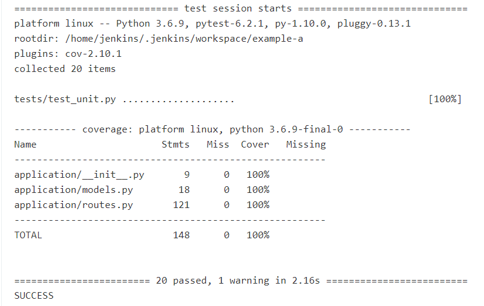
<br/>
If any of the unit testing fails, the entire Jenkins build is marked as a fail, as you can see in the example below. The as-live environment is still brought online for the developer to use, however.  
<br/>
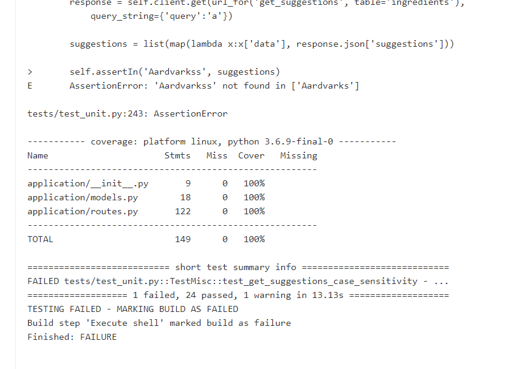

### Front-End
#### Home Page
When navigating to the home page (/home) or to the URL with no specified path, the user is given the list of current recipe entries. Each entry is shown as the recipe's title and the recipe's description (if applicable). Tapping on the title directs the user to [view](#recipe-viewing) the recipe.
<br/><br/>
At the top of the page is a navigation bar (defined in a base layout template, and therefore available on every page). One of the links directs the user to the home page, and the other to a [recipe creation](#recipe-creation) page.
<br/><br/>
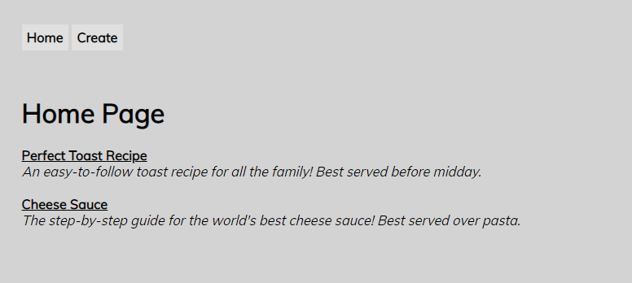

CRUD implemented on this page: READ
<br/><br/>

#### Recipe Creation
When the user navigates to the creation page (/create) a recipe entry is immediately created in the database. The database for the entry is then updated every time the user edits and submits a field.
<br/><br/>
Since ingredients are stored in a foreign table, they work slightly differently in the form. You can't edit them the same as you can with the title, description, and method. Instead, you can delete an ingredient from the ignredients list, and you can create an ingrededient to add to the ingredients list.
<br/><br/>
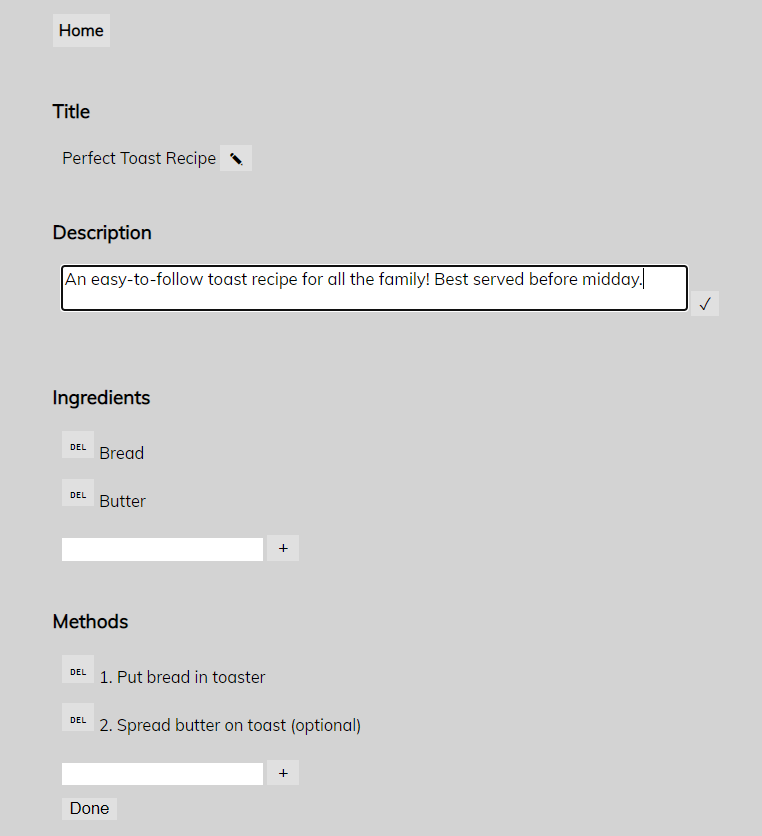

CRUD implemented on this page: all 
<br/><br/>

#### Recipe Viewing
When the user navigates to view a recipe from the home page they are given all relevant details on the recipe.
<br/><br/>
At the bottom of this page, buttons can be used to direct to edit or delete the recipe.
<br/><br/>
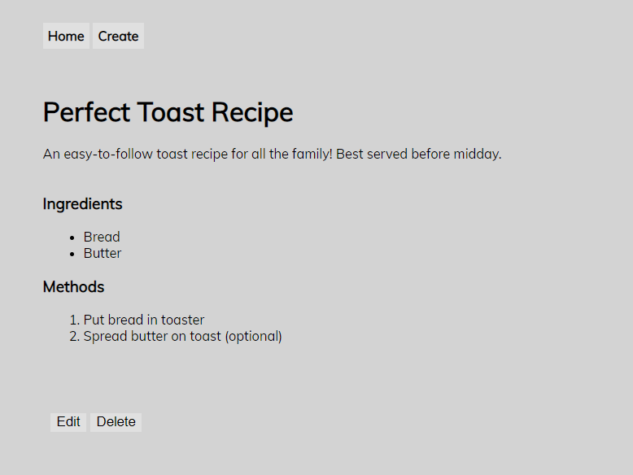

CRUD implemented on this page: READ, DELETE
<br/><br/>

### Integration Testing
Integration testing is used in this project to test the functional aspects of the app as a whole. In my approach I use selenium to simulate a user navigating the site (by clicking on elements in each page) and filling in forms as the testing specifies, and then my tests also check the database for the expected data.
<br/><br/>
Much like the unit tests, these tests are also automated using Jenkins.
<br/>
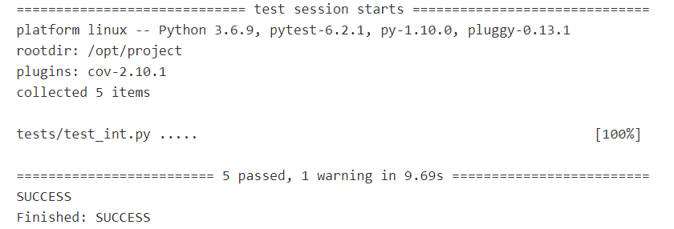
<br/>
If any of the integration testing fails, the entire Jenkins build is marked as a fail. 
<br/>

## Footer
### Future Improvements
* As mentioned in the original proposal, a future version should contain user profiles - this would also allow locking deleting/editing recipes to the recipe author or admin users.
* The ability to set the amount of an ingredient required for the recipe, as well as how many people that amount of ingredients would serve. The former would be added to the association (recipe_ingredient) table, and the latter to the recipe table.

### Author
Oliver Nichols

### Acknowledgements
* [Harry Volker](https://github.com/htr-volker)
* [Nathan Forester](https://github.com/nathanforester) 